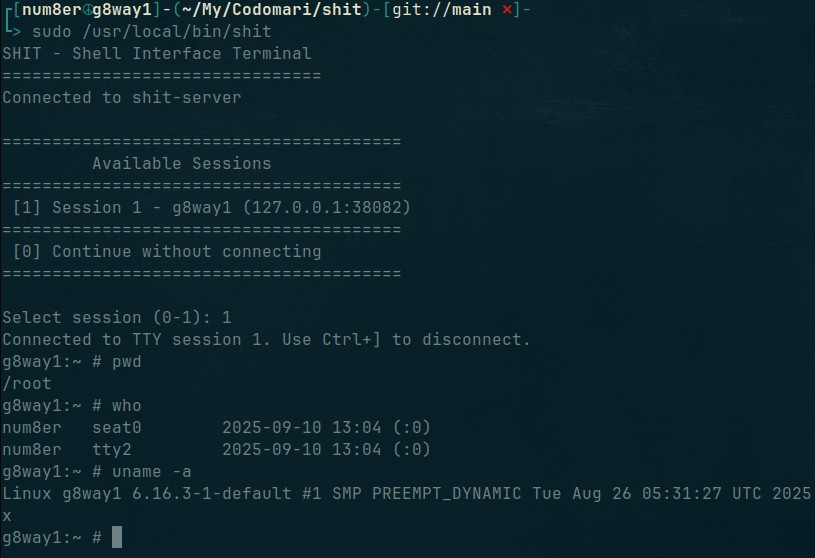
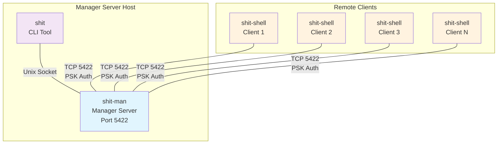

# Shit - Secure Reverse Remote Shell System



A secure remote shell system with three components:
- **shit-shell**: Reverse shell client that connects to external server and listens for commands
- **shit-man**: Server that manages client connections and sessions  
- **shit**: CLI tool for interacting with connected clients

## How It Works

### Architecture Overview



The system uses a client-server architecture with three distinct components:

1. **shit-man (Manager Server)**: Central server that listens on TCP port 5422 for incoming client connections and manages a Unix socket for CLI communication. Handles multiple concurrent client sessions.
2. **shit-shell (Client)**: Reverse shell client that connects to the shit-man server and provides secure shell access
3. **shit (CLI)**: Local CLI tool that connects to shit-man via Unix socket to control and interact with any connected client session

### Security Model

- **PSK Authentication**: Uses 128-byte pre-shared keys for client authentication
- **Automatic Key Exchange**: Keys are automatically generated on first connection
- **Secure Storage**: 
  - Client keys stored in `/etc/shit/.keys`
  - Server authorized keys in `/etc/shit/.authorized_keys`
  - All files and logs centralized in `/etc/shit/`

### Protocol

- **Transport**: TCP communication on port 5422
- **Messaging**: JSON-RPC protocol for all communication
- **TTY Support**: Full terminal proxy with resize and interactive shell support
- **Session Management**: Each client gets a unique session with keepalive pings

## Installation

### Build from Source
```bash
./build.sh
```

### Install Components
```bash
sudo ./install.sh
```

Choose from:
1. shit-shell (reverse shell client)
2. shit-man (server daemon)  
3. shit (CLI tool)
4. All components

### Uninstall
```bash
sudo ./uninstall.sh
```

Configuration files in `/etc/shit/` are preserved during uninstall.

## Usage

### 1. Manager Server Setup (shit-man)
```bash
# Start the server
sudo systemctl start shit-man

# Check status
sudo systemctl status shit-man

# Enable auto-start
sudo systemctl enable shit-man

# View logs
sudo journalctl -u shit-man -f
```

### 2. Client Setup (shit-shell) - Multiple Clients
```bash
# Configure server address if not localhost (edit systemd service)
sudo systemctl edit shit-shell

# Start the client
sudo systemctl start shit-shell

# Check status  
sudo systemctl status shit-shell

# View logs
sudo journalctl -u shit-shell -f
```

### 3. CLI Usage (shit) - Managing Multiple Clients
```bash
# Start the CLI
shit

# Available commands:
/help, /h          # Show help message
/list, /ls         # List active sessions
/menu              # Show session selection menu
/connect, /c <id>  # Connect to a specific session
/q, /quit, /exit   # Disconnect from session (or exit if not connected)

# When connected to a session:
# - Any text WITHOUT / is sent to the remote shell
# - Use /q to disconnect from current session
# - Press Ctrl+C to interrupt a running command
# - Press Ctrl+] to disconnect from TTY mode
```

## Configuration

### Environment Variables

**shit-shell (client)**:
- `SHIT_MAN_ADDR`: shit-man server address (default: 127.0.0.1)
- `SHIT_KEYS_FILE`: PSK file path (default: .keys)  
- `SHIT_DEBUG`: Enable debug logging (default: false)

**shit-man (manager server)**:
- `SHIT_MAN_LISTEN_AT`: Listen address (default: 0.0.0.0)
- `SHIT_SOCKET_PATH`: Unix socket path (default: /var/run/shit-man.sock)
- `SHIT_AUTHORIZED_KEYS`: Authorized keys file (default: .authorized_keys)
- `SHIT_SERVER_DEBUG`: Enable debug logging (default: false)

**shit (CLI)**:
- `SHIT_SOCKET_PATH`: Manager server socket path (default: /var/run/shit-man.sock)

### File Structure

```
/etc/shit/                    # Central configuration directory
├── .keys                     # Client PSK keys
├── .authorized_keys          # Server authorized keys  
└── logs/                     # Application logs

/usr/local/bin/               # Installed binaries
├── shit-shell                # Reverse shell client daemon
├── shit-man                  # Manager server daemon
└── shit                      # CLI tool

/etc/systemd/system/          # Systemd services
├── shit-shell.service        # Client service (can run on multiple hosts)
├── shit-man.service          # Manager server service
└── [shit.service]            # CLI doesn't need service
```

## Network Flow

1. **Multiple Client Connections**:
   - Multiple shit-shell clients connect to shit-man server on port 5422
   - Each client performs automatic key exchange if no PSK exists
   - All clients authenticate using individual PSK keys

2. **Session Management**:
   - shit-man assigns unique session ID to each connected client
   - Server maintains multiple concurrent client sessions
   - Keepalive pings maintain all connections
   - Sessions persist until individual clients disconnect

3. **Interactive Shell Access**:
   - shit connects to shit-man via local Unix socket
   - User can list all connected shit-shell sessions
   - User can connect to get interactive shell access to any shit-shell client
   - Full TTY data proxied between local terminal and remote shit-shell
   - Server handles multiplexing between multiple shit-shell sessions and single interactive shell

## Security Features

- **Encrypted Communication**: All traffic uses PSK-based authentication
- **Isolated Sessions**: Each client runs in its own session context
- **Privilege Control**: Services run as root but can be configured otherwise
- **Audit Trail**: All connections and commands are logged
- **Key Rotation**: Keys can be regenerated by deleting existing key files

## Troubleshooting

### Common Issues

1. **Connection Refused**: 
   - Check if shit-man manager is running: `systemctl status shit-man`
   - Verify firewall allows port 5422: `netstat -ln | grep 5422`
   - Check if multiple clients are trying to connect simultaneously

2. **Authentication Failed**:
   - Remove key files to force regeneration: `rm /etc/shit/.keys /etc/shit/.authorized_keys`
   - Restart both services

3. **CLI Can't Connect to Manager**:
   - Check Unix socket exists: `ls -la /var/run/shit-man.sock`
   - Verify permissions and ownership
   - Ensure shit-man manager server is running

4. **Service Won't Start**:
   - Check logs: `journalctl -u [service-name] -f`
   - Verify configuration directory exists: `ls -la /etc/shit/`

### Log Locations

- System logs: `journalctl -u [service-name]`
- Application logs: `/etc/shit/logs/` (if configured)
- Service status: `systemctl status [service-name]`

## Development

Built with Go 1.21+ using standard library plus:
- `github.com/creack/pty`: PTY management  
- `golang.org/x/term`: Terminal handling

Module structure:
```
shit/
├── cmd/                      # Application entry points
│   ├── shit-shell/           # Reverse shell client daemon
│   ├── shit-man/             # Manager server daemon  
│   └── shit/                 # CLI tool for managing clients
├── internal/                 # Internal packages
│   ├── apps/                 # Application logic
│   ├── config/               # Configuration
│   ├── crypto/               # PSK management
│   └── protocol/             # Message protocol
└── *.sh                      # Build/install scripts
```

All internal imports use the `shit/` prefix for local development.
